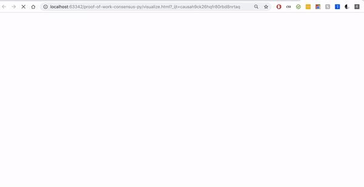
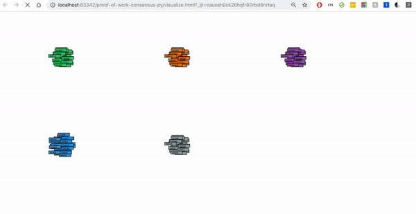

# Improving a proof of work consensus implementation in Python
<https://sites.google.com/a/stonybrook.edu/sbcs535/projects/proof-of-work-consensus-py>

## Authors
* Shubham Jindal (SBU ID: 112129688)
* Arun Swaminathan (SBU ID: 112044697)
* Hardik Singh Negi (SBU ID: 111886786)

## How to Run Project
* `constants.py` 

This contains few of the adjustable parameters such as DIFFICULTY, BLOCKCHAIN_LENGTH etc. which can be adjusted to get different results when running the blockchain
* Execute `run.sh` to start the blockchain.

By default 5 miners are run which mine the transactions produced by 2 nodes.
Each transaction produced by the nodes have a sleep time of 1s. This is because when the difficulty is increased to a larger number, too many tranasactions are pending while the proof of work is being done, which causes buffer overflow. To avoid this, we need to increase the sleep time in node.da when we are increasing the difficulty substantially.

* Open `visualize.html` in your web-browser to analyze the blockchain. 

Use `Zoom-out` functionality in the browser to see all 5 blockchains together. You can also hower over each node to see its transactions and previous hash.
The red color node is the genesis/starting block.
   
## Visualization

#### A blockchain with 5 miners, 10 difficulty, and 25 block length

As we can see there are many forks which are occurring due to low difficulty.
  

#### A blockchain with 5 miners, 15 difficulty, and 25 block length  

The number of forks were reduced to 1 on increasing difficulty to 15.

## References
* https://github.com/bitcoinbook/bitcoinbook
* https://github.com/Blockchain-for-Developers/merkle-tree/blob/master/merkle_tree.py
* https://github.com/koshikraj/justblockchain
